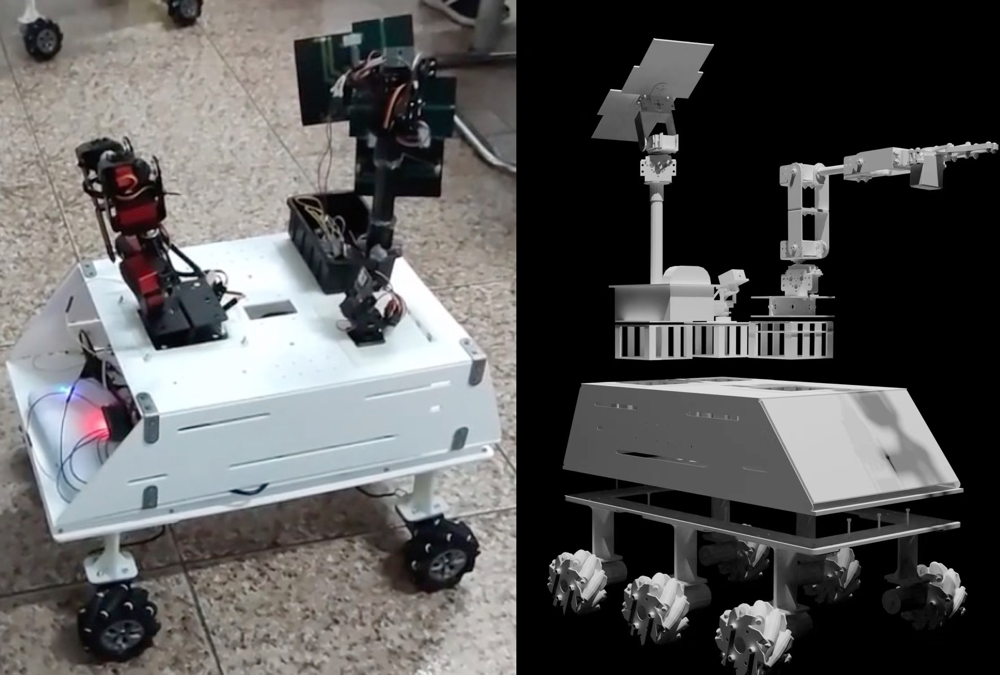

# 2020 UMJI-VG100 Project- Group 3

A modular mars rover with function modules including camera, robotic arms, Karaoke, solar panel system and replaceble chassis.

- [Video Demo](https://www.bilibili.com/video/BV1tA411Y7L9)
- [Poster](https://raw.githubusercontent.com/Jiayi-Pan/MarsRover/master/Poster_Group3.jpg)
